# Installing Jenkins on Ubuntu

## Step 1: Update System Packages

First, update your system packages to ensure you have the latest versions.

```sh
sudo apt update
sudo apt upgrade -y
```

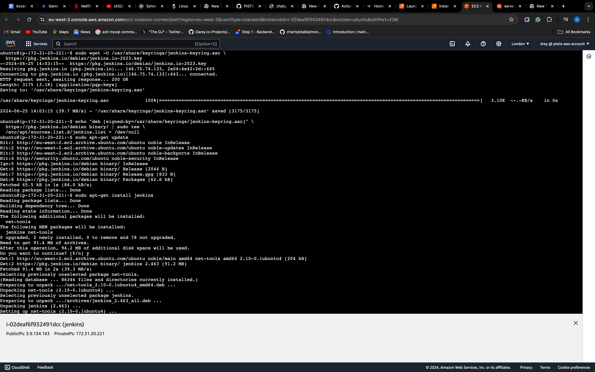

## Step 2: Install Java

Jenkins requires Java to run. Install OpenJDK 11, which is a recommended version for Jenkins.

```sh
sudo apt install fontconfig openjdk-17-jre
```

Verify the installation:

```sh
java -version
```

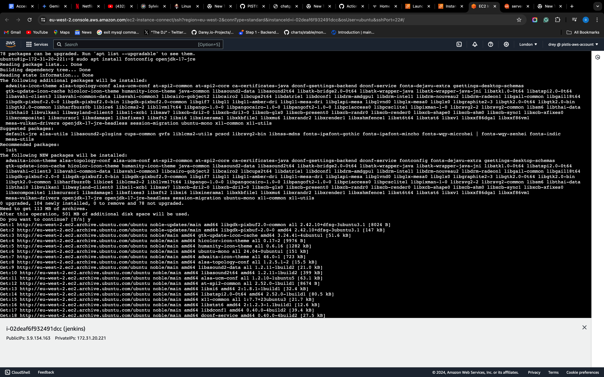

## Step 3: Add Jenkins Repository

Add the Jenkins Debian repository to your system:

```sh
sudo wget -O /usr/share/keyrings/jenkins-keyring.asc \
  https://pkg.jenkins.io/debian-stable/jenkins.io-2023.key
```

Then, add the repository to your system:

```sh
echo "deb [signed-by=/usr/share/keyrings/jenkins-keyring.asc]" \
  https://pkg.jenkins.io/debian-stable binary/ | sudo tee \
  /etc/apt/sources.list.d/jenkins.list > /dev/null
```


## Step 4: Install Jenkins

Update the package list again and install Jenkins:

```sh
sudo apt-get update
sudo apt-get install jenkins
```


## Step 5: Start and Enable Jenkins

Start the Jenkins service and enable it to start on boot:

```sh
sudo systemctl start jenkins
sudo systemctl enable jenkins
```

Check the status to ensure Jenkins is running:

```sh
sudo systemctl status jenkins
```

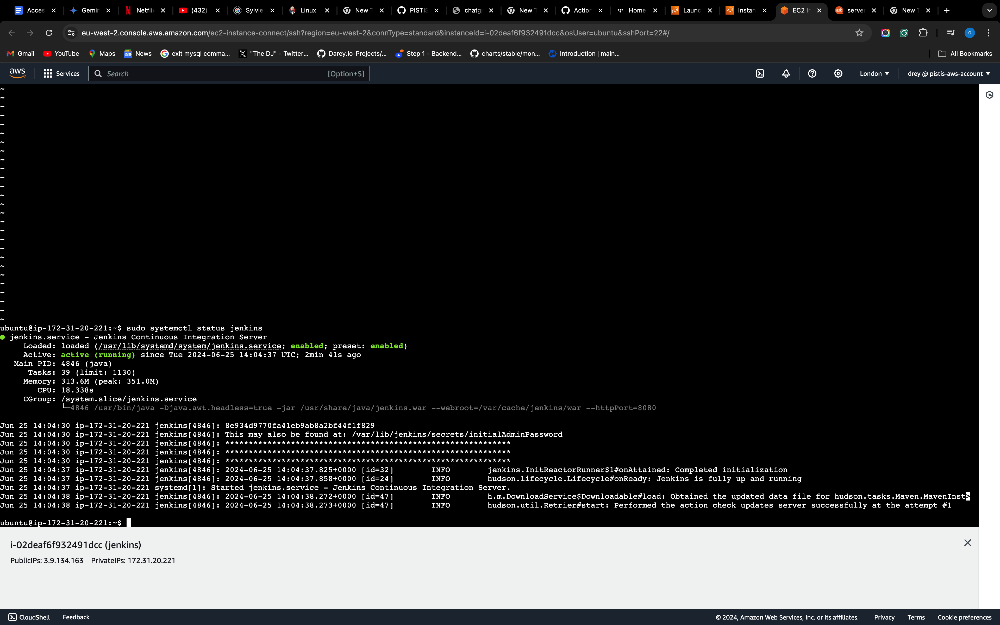

## Step 6: Adjust Firewall

If you have UFW (Uncomplicated Firewall) running, allow traffic on port 8080 (the default port for Jenkins):

```sh
sudo ufw allow 8080
sudo ufw status
```

## Step 7: Setup Jenkins

Open your web browser and go to `http://your_server_ip_or_domain:8080`. You will be prompted to unlock Jenkins.

Retrieve the initial admin password:

```sh
sudo cat /var/lib/jenkins/secrets/initialAdminPassword
```

Enter this password in the web interface.

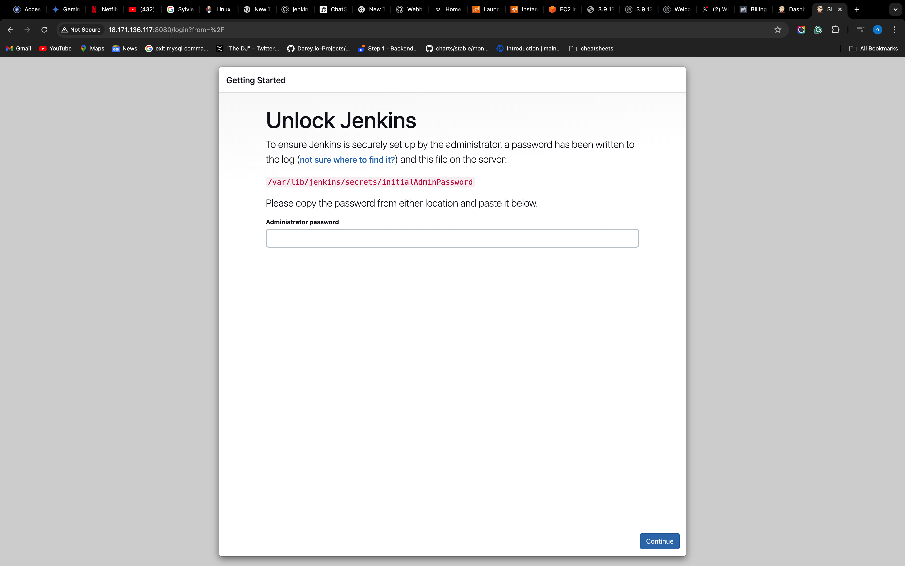
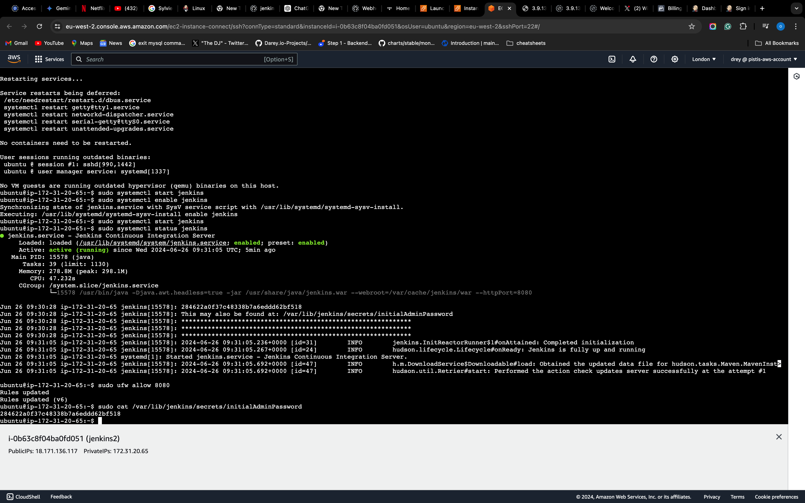

## Step 8: Install Suggested Plugins

After unlocking Jenkins, you will be prompted to install plugins. Choose "Install suggested plugins."

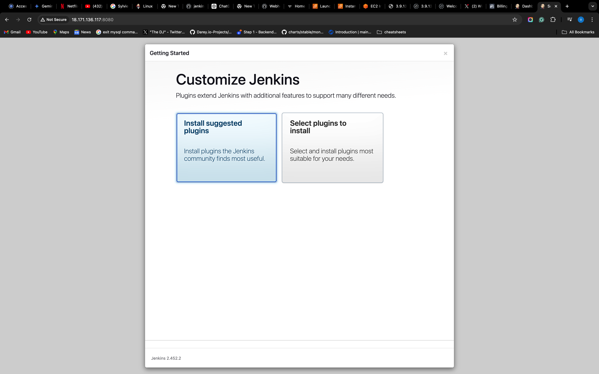
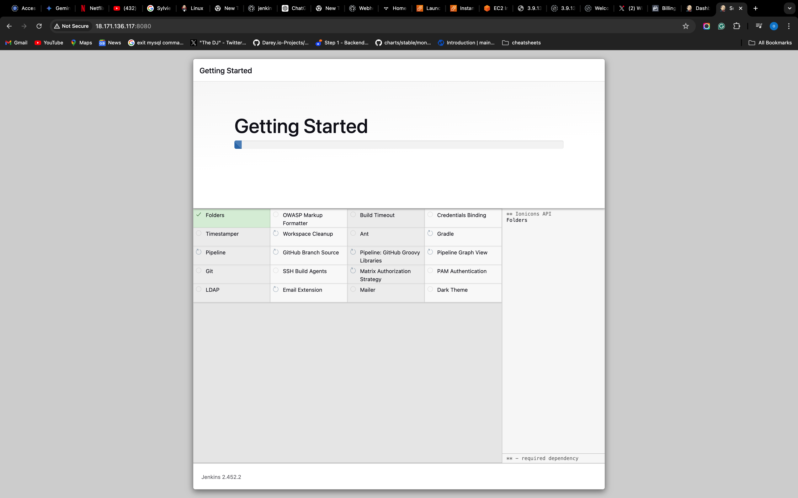

## Step 9: Create Admin User

Create an admin user with your desired credentials.

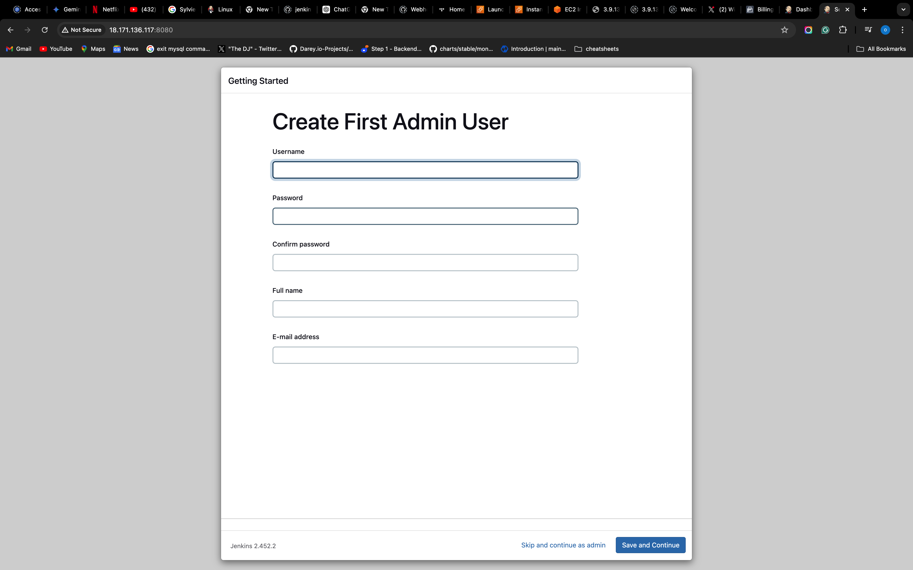

## Step 10: Jenkins is Ready

After the setup is complete, you will be redirected to the Jenkins dashboard, indicating that Jenkins is ready for use.

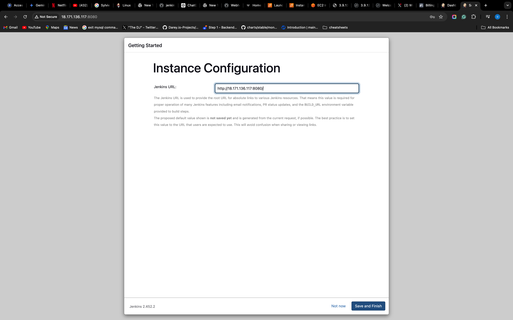

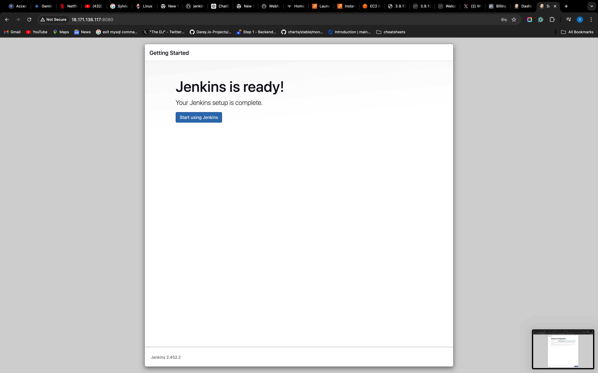

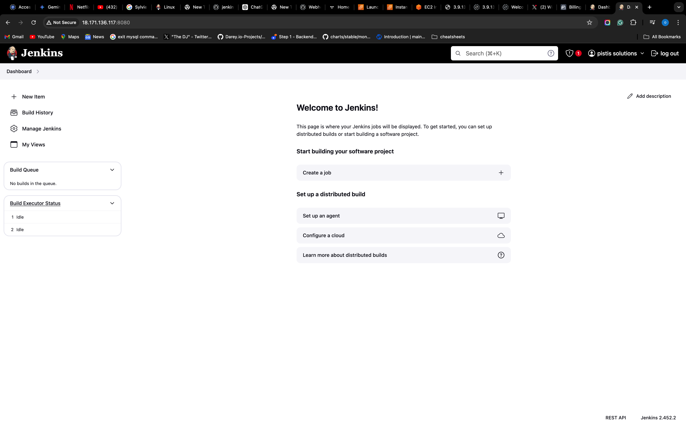


## Extra Plugins to Install
- Blue Ocean
- Multibranch webhook plugin
- Git Plugin

### Example of jenkins webhook
-  http://<your-instance-ip>/multibranch-webhook-trigger/invoke?token=my-token
